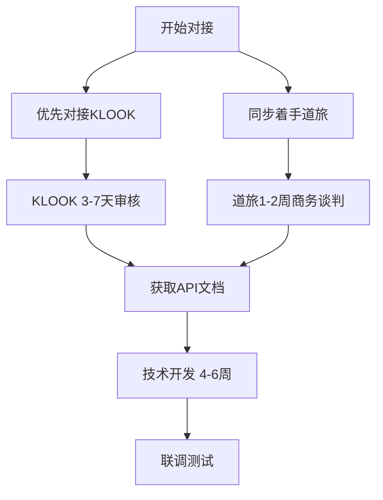

# 技术可行性分析报告

> **评审对象**：旅游行业闭环多智能体协同平台（Agent-as-a-Service）
> **评审角色**：技术合伙人
> **评审原则**：拒绝幻觉、切合实际、可落地执行为核心
> **评审日期**：2025年

---

## 一、总体评估

### 评分总览

| 评估维度 | 评分 | 说明 |
|---------|------|------|
| 技术架构可行性 | ⭐⭐⭐⭐☆ 4/5 | 多Agent架构已验证可行，但需扩展 |
| API对接可行性 | ⭐⭐⭐☆☆ 3/5 | 主要B2B平台有API，但需商务谈判 |
| 资源商品化可行性 | ⭐⭐⭐⭐☆ 4/5 | 技术上可行，核心是人工工作量大 |
| 人机协同可行性 | ⭐⭐⭐⭐⭐ 5/5 | 已有成熟的技术方案 |
| 预算合理性 | ⭐⭐⭐⭐☆ 4/5 | 300万种子轮合理但需精打细算 |
| 落地周期 | ⭐⭐⭐☆☆ 3/5 | MVP需6-9个月，完全成熟需12-18个月 |
| **综合评分** | **⭐⭐⭐⭐ 4/5** | **可行，但关键节点有明确风险** |

---

## 二、已有技术基础（已验证）

### 2.1 多Agent协同架构 ✅（核心优势）

BP中提出的多Agent协同体系，**我们已有完整的可运行实现**：

| BP描述 | 已有实现 | 状态 |
|-------|---------|------|
| Orchestrator（编排Agent） | `coordinator.py` | ✅ 已实现 |
| Itinerary（行程规划Agent） | `multi_agent.py` - ItineraryAgent | ✅ 已实现 |
| Validation（校验Agent） | `multi_agent.py` - ValidationAgent | ✅ 已实现 |
| Delivery（对客输出Agent） | `multi_agent.py` - DeliveryAgent | ✅ 已实现 |
| 知识采集Agent | `knowledge_harvester_agent.py` | ✅ 已实现 |
| Agent短期记忆 | `memory_saver.py` + PostgreSQL | ✅ 已实现 |
| 流式输出 | FastAPI SSE + WebSocket | ✅ 已实现 |

**结论**：多Agent协同架构不是"从0到1"，而是"从1到10"，这是项目最大的技术优势。

### 2.2 核心能力清单

```
✅ 多Agent状态流转（LangGraph StateGraph）
✅ 模型调用（doubao-seed-1-6-thinking, deepseek-r1等）
✅ Web搜索能力
✅ 知识库（RAG）集成
✅ PostgreSQL数据持久化
✅ RESTful API + SSE流式输出 + WebSocket
✅ 错误处理与兜底机制
✅ React前端集成示例
```

---

## 三、核心风险深度分析

### 风险一：B2B平台API对接（最高风险 🔴）

#### 现状调研

| B2B平台 | API开放情况 | 对接条件 | 风险评估 |
|---------|------------|---------|---------|
| **道旅（DidaTravel）** | 有XML/API接口，24h可对接 | 需签约成为分销商，审核旅行社资质 | 🟡 中等 |
| **喜玩** | 有API接口 | 需商务合作 | 🟡 中等 |
| **汇智** | 有API接口 | 需商务合作 | 🟡 中等 |
| **M2M** | 有API接口 | 需商务合作 | 🟡 中等 |
| **KLOOK** | 有开放平台/商户入驻 | 3-7个工作日审核 | 🟢 较低 |
| **曹操出行/首汽/北汽** | 有企业级API | 需企业合作签约 | 🟡 中等 |

#### 核心问题

> **这些API接口需要商务合作+资质审核，不是开放的无门槛API**

BP中提到的"API对接"在技术上是可行的，但在**商务层面**存在明确的门槛：
1. 需要旅行社资质或相关行业资质
2. 需要签署合同、约定分佣比例
3. 部分平台有最低订单量要求
4. API文档的获取需要NDA（保密协议）

#### 应对策略（可执行）



**务实建议**：
1. **第一步**：先对接KLOOK（门槛最低，审核快）
2. **第二步**：利用创始人的行业资质快速对接道旅
3. **第三步**：其他平台逐步接入，不要一上来就全量对接

### 风险二：资源商品化工作量（中风险 🟡）

#### 工作量估算

BP中提到将"海外非标资源批量转化为标准化商品"，这是**正确的方向**，但工作量不可低估：

| 资源类型 | 预估条数 | 每条字段数 | 单条录入时间 | 总工时 |
|---------|---------|-----------|------------|-------|
| 包车服务（欧洲） | 50-100条 | 15-20个 | 20分钟 | 20-35小时 |
| 包车服务（日韩） | 30-50条 | 15-20个 | 20分钟 | 10-17小时 |
| 通票/周游券 | 30-50条 | 12-15个 | 15分钟 | 8-13小时 |
| 导游服务 | 50-100人 | 15-20个 | 15分钟 | 13-25小时 |
| 特色体验 | 50-100条 | 15-20个 | 20分钟 | 17-33小时 |
| **合计** | **210-400条** | - | - | **68-123小时** |

#### 结论
- **技术难度**：低（结构化数据建模、CRUD）
- **工作量大**：68-123小时的"脏活累活"
- **执行建议**：开发一个**资源管理后台**，让运营人员（非技术人员）自助录入
- **重要**：这个工作不可跳过，也不能100%靠AI自动化

### 风险三：实时价格与库存查询（中风险 🟡）

#### 技术方案

```python
# 推荐的缓存策略
B2B API 实时查询（200-500ms/次）
        │
        ▼
   本地缓存（Redis, TTL=60秒）
        │
        ▼
   返回结果给用户
```

#### 性能估算
| 场景 | B2B平台数 | 并发查询数 | 总耗时 |
|------|----------|-----------|--------|
| 酒店比价 | 3-4个 | 3-4次并行 | 300-500ms |
| 门票查询 | 1-2个 | 1-2次并行 | 200-400ms |
| 用车查询 | 1-2个 | 1-2次并行 | 200-400ms |
| 导游匹配 | 本地数据库 | 1次查询 | <10ms |
| **合计** | - | - | **<1秒** |

#### 风险点
- B2B平台API的响应速度和稳定性是关键
- 需要做**熔断降级**：如果一个平台超时，自动切换到其他平台或返回缓存数据
- 建议预留**30%的性能缓冲**

### 风险四：多语言支持（低风险 🟢）

#### 当前能力
- ✅ 已有模型（doubao-seed-2-0-pro等）支持多语言
- ✅ 知识库支持多语言内容
- ✅ Coze平台已有成熟的多语言方案

#### 结论
多语言能力可以直接利用模型原生能力，**不需要额外开发**。

---

## 四、技术实现路径（12个月路线图）

### 第一阶段：核心技术验证（第1-3月）

**预算分配**：60万

| 任务 | 负责人 | 时间 | 产出 |
|------|-------|------|------|
| ✅ 对接KLOOK API | AI工程师 | 4周 | 门票资源查询能力 |
| ✅ 对接道旅API（商务+开发） | 创始人+AI工程师 | 6周 | 酒店资源查询能力 |
| ✅ 资源商品化数据结构设计 | 后端工程师 | 2周 | 数据库模型+后台管理界面 |
| ✅ 资源初始化录入（500条） | 运营人员 | 4周 | 基准资源库 |
| ✅ 多Agent系统扩展 | AI工程师 | 6周 | 新增资源匹配Agent |

**里程碑**：✅ 单场景（如欧洲）的**AI生成+实时报价**MVP可运行

### 第二阶段：MVP开发（第4-6月）

**预算分配**：100万

| 任务 | 负责人 | 时间 | 产出 |
|------|-------|------|------|
| ✅ 完成主要B2B平台对接 | AI工程师 | 8周 | 多源比价能力 |
| ✅ AI方案生成+实时报价 | AI工程师 | 6周 | 核心产品功能 |
| ✅ 人机协同工作台 | 后端工程师 | 8周 | 人工审核/修改工具 |
| ✅ 客户自助下单系统 | 全栈工程师 | 6周 | 前端下单流程 |
| ✅ 3家种子客户试用 | 市场团队 | 持续 | 真实订单验证 |

**里程碑**：✅ 3家种子客户的**真实订单闭环**

### 第三阶段：产品迭代（第7-12月）

**预算分配**：140万

| 任务 | 负责人 | 时间 | 产出 |
|------|-------|------|------|
| ✅ 更多B2B平台接入 | AI工程师 | 持续 | 资源覆盖面扩展 |
| ✅ 性能优化 | 所有工程师 | 持续 | 响应时间<3秒 |
| ✅ 自动化测试体系 | QA工程师 | 8周 | 异常场景覆盖率>90% |
| ✅ 更多场景扩展 | 产品团队 | 持续 | 差旅/研学/团建 |
| ✅ 10-20家付费客户 | 市场团队 | 持续 | 稳定的现金流 |

**里程碑**：✅ 月活客户20家，月营收50万+

---

## 五、团队配置建议

### 核心团队（种子轮）

| 角色 | 人数 | 月薪范围 | 年成本 | 说明 |
|------|------|---------|--------|------|
| AI/后端工程师（资深） | 1人 | 25-35K | 30-42万 | LangChain/LangGraph核心开发 |
| 后端工程师（初中级） | 1人 | 15-20K | 18-24万 | API对接、系统集成 |
| 全栈工程师 | 1人 | 20-25K | 24-30万 | 前端+后端、管理后台 |
| 产品/运营 | 1人 | 15-20K | 18-24万 | 资源录入、种子客户 |
| **合计** | **4人** | - | **90-120万/年** | - |

### 为什么是这个配置？

| 角色 | 不可替代性 | 说明 |
|------|-----------|------|
| AI工程师（1人） | 🔴 不可替代 | 多Agent系统、模型调优、知识库，必须有人精通 |
| 后端工程师（1人） | 🟡 可部分外包 | B2B API对接、数据库设计、系统集成 |
| 全栈工程师（1人） | 🟡 可部分外包 | 管理后台、客户端、API开发 |
| 产品/运营（1人） | 🔴 不可替代 | 资源录入、客户对接、产品设计 |

### 不建议的配置

```
❌ 招5个AI研究员研究新模型 → 完全不需要，直接使用现有模型
❌ 招2个全栈同时做前后端 → 不如分工明确
❌ 招1个架构师做"顶层设计" → 需要的是能写代码的人
```

### 关于外包

```
✅ 可以外包的部分：
  - 前端UI组件开发（明确、标准）
  - B2B平台商务谈判（由创始人主导）
  - 服务器运维（初期简单）

❌ 不建议外包的部分：
  - AI Agent核心逻辑
  - API对接（涉及数据安全）
  - 资源商品化（需要行业知识）
```

---

## 六、预算详细分析

### 300万怎么花（务实版）

| 项目 | 金额 | 占比 | 明细 |
|------|------|------|------|
| **人力成本** | 120万 | 40% | 4人团队，12个月 |
| **服务器/基础设施** | 24万 | 8% | 云服务器、数据库、CDN、API费用 |
| **B2B平台保证金/预充值** | 30万 | 10% | 部分平台需要预充值 |
| **外部开发外包** | 30万 | 10% | 前端UI、部分API对接 |
| **市场推广/差旅** | 36万 | 12% | 展会、客户拜访、差旅 |
| **法务/资质/合规** | 15万 | 5% | 公司注册、资质申请、合同 |
| **办公/运营** | 30万 | 10% | 办公场地、设备、通讯 |
| **备用金** | 15万 | 5% | 风险储备 |
| **合计** | **300万** | **100%** | - |

### 与BP预算对比

| 预算项 | BP版 | 务实版 | 差异说明 |
|-------|------|--------|---------|
| 技术研发 | 180万（60%） | 174万（58%） | ✅ 基本一致 |
| 市场开拓 | 105万（35%） | 66万（22%） | ⚠️ 种子轮阶段市场费用不宜过高 |
| 运营备用 | 15万（5%） | 60万（20%） | ⚠️ 需要为API平台预充值留足资金 |

### 资金使用节奏

```
第1-3月：消耗 80万（团队搭建+基础开发）
第4-6月：消耗 90万（MVP+种子客户）
第7-9月：消耗 70万（迭代优化）
第10-12月：消耗 60万（规模扩展）
          ─────
合计：300万
```

---

## 七、关键成功指标（KPI）

### 技术指标

| 指标 | 目标值 | 测量方式 |
|------|-------|---------|
| 方案生成时间 | <3分钟 | 端到端计时 |
| B2B API响应时间 | <1秒 | P99分位 |
| 方案准确率 | >90% | 人工评审 |
| 系统可用性 | >99.5% | 监控告警 |

### 业务指标

| 指标 | 目标值 | 说明 |
|------|-------|------|
| 种子客户数 | 3-5家（第6月） | 真实付费客户 |
| 月活跃客户 | 20家（第12月） | 稳定使用的客户 |
| 计调效率提升 | 50%+ | 对比人工模式 |
| 客户留存率 | >80% | 月度留存 |

---

## 八、结论与建议

### 可行性结论

```
╔══════════════════════════════════════════════════╗
║  综合技术可行性：✅ 可行（4/5）                  ║
║                                                  ║
║  核心优势：                                      ║
║  ✅ 多Agent架构已有成熟实现                       ║
║  ✅ 技术栈经过验证                               ║
║  ✅ 人机协同方案务实可行                         ║
║                                                  ║
║  核心风险：                                      ║
║  ⚠️ B2B平台API需商务谈判（可控风险）             ║
║  ⚠️ 资源商品化需大量人工（可管理）                ║
║  ⚠️ 需在12个月内形成现金流闭环（时间紧张）        ║
║                                                  ║
║  作为技术合伙人，我给出：✅ 赞成执行              ║
╚══════════════════════════════════════════════════╝
```

### 我的核心建议

#### 建议一：先做减法，再做加法
```
❌ 错误做法：一上来就对接所有B2B平台
✅ 正确做法：先只对接KLOOK + 道旅，跑通MVP

原因：
- KLOOK审核最快（3-7天），可以快速验证技术方案
- 道旅覆盖最广，是核心的酒店资源
- 其他平台可以在MVP验证后再加
```

#### 建议二：资源商品化要"先粗后精"
```
❌ 错误做法：花3个月把所有资源精细化入库
✅ 正确做法：先入库300条核心资源，让MVP跑起来

原因：
- 先让系统"能用"，再让系统"好用"
- 真实订单会告诉你哪些资源是高频的
- 持续迭代比一次完美更实际
```

#### 建议三：团队要"小而精"
```
❌ 错误做法：招5-6个开发人员，各干各的
✅ 正确做法：4人团队，每个人都必须能打

核心团队画像：
1. 1个AI工程师：能写LangChain/LangGraph，懂大模型
2. 1个后端工程师：能写API对接、数据库、系统集成
3. 1个全栈工程师：能写前端+后端，做管理后台
4. 1个行业产品：懂旅游行业，能录入资源、对接客户
```

#### 建议四：资金要"精打细算"
```
前6个月不要全部烧掉！
建议资金使用节奏：
- 第1-6月：消耗约60%（180万），用于MVP开发和种子客户
- 第7-12月：消耗约40%（120万），用于迭代和规模扩展

原因：
- 种子轮后通常有6-12个月的"窗口期"拿下一轮
- 留余粮给迭代和应对突发情况
- 现金流管理比技术更重要
```

#### 建议五：技术不要自研，要集成
```
❌ 错误做法：
  - 自己训练大模型
  - 自研NLP引擎
  - 自建供应链系统

✅ 正确做法：
  - 使用Coze/OpenAI等成熟大模型
  - 对接现有B2B平台API
  - 集成已有行业工具

原因：
- 聚焦业务价值，不重复造轮子
- 降低技术风险和维护成本
- 快速迭代，快速验证
```

---

## 九、附录：与BP的技术差异评估

| BP描述 | 当前实现 | 差距 | 工作量 |
|-------|---------|------|--------|
| 多Agent协同 | ✅ 已有 | 无 | 0 |
| 知识库（RAG） | ✅ 已有 | 无 | 0 |
| 需求解析 | ✅ 已有（Prompt层） | 较少 | 2周 |
| 资源比价 | ⚠️ web_search替代 | 需要对接B2B API | 8-12周 |
| 行程编排 | ✅ 已有 | 无 | 0 |
| 精准报价 | ❌ 无 | B2B API+资源商品化 | 12-16周 |
| 下单系统 | ❌ 无 | 需要开发 | 6-8周 |
| 人工审核工作台 | ❌ 无 | 需要开发 | 4-6周 |
| 资源管理后台 | ❌ 无 | 需要开发 | 4-6周 |

---

## 十、最终结论

> **作为技术合伙人，我的结论是：项目可行，方向正确，立即开始。**
>
> 但前提是：**不做大而全，做小闭环**。先只聚焦一个市场（如欧洲高净值定制），只对接最核心的B2B平台（KLOOK+道旅），先入库300条核心资源，用3家种子客户验证闭环，再逐步扩展。
>
> **技术不是最大的问题，执行才是。**

